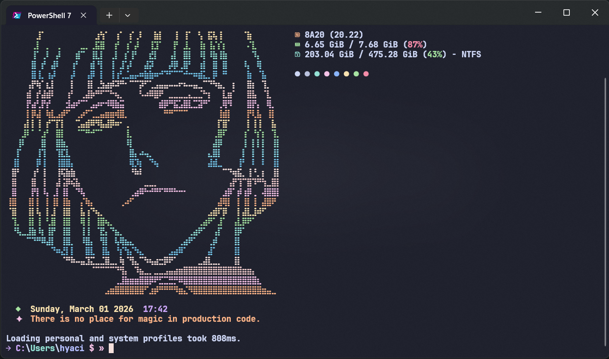
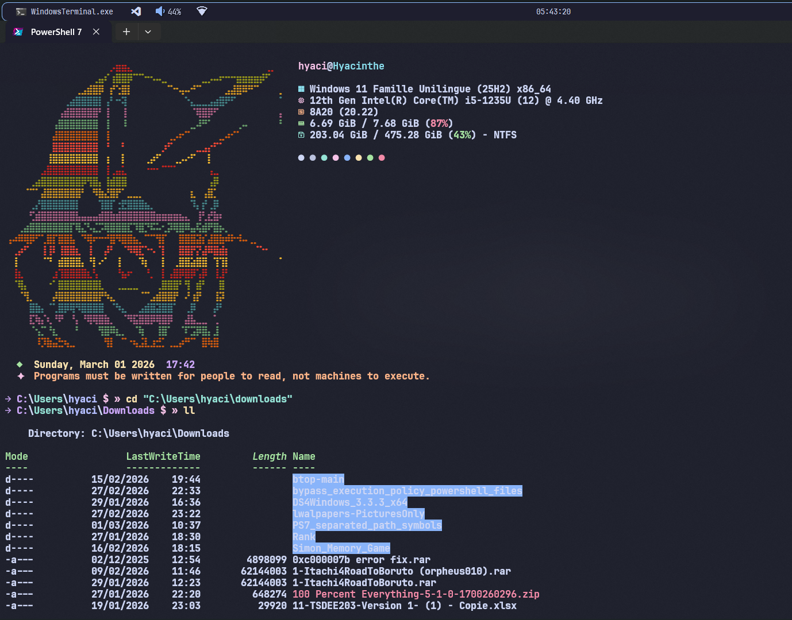
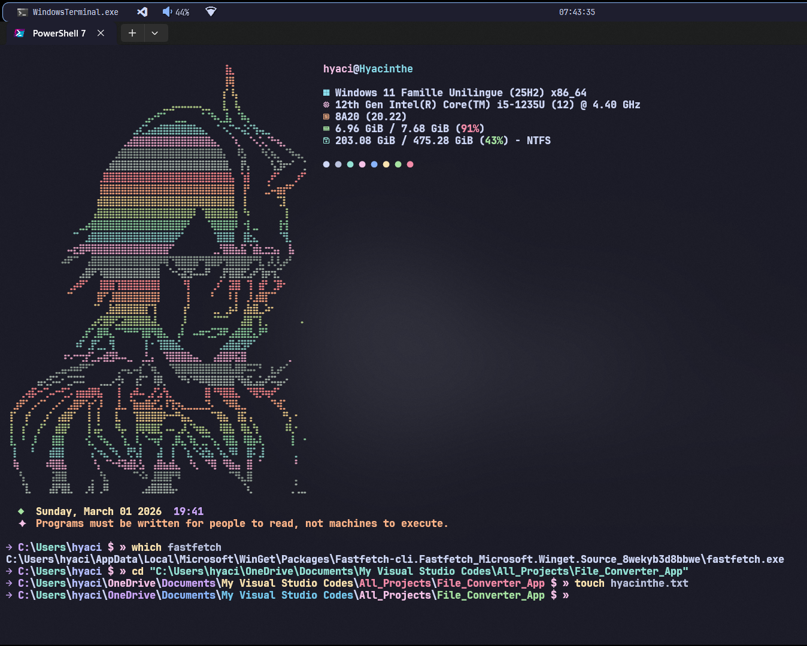
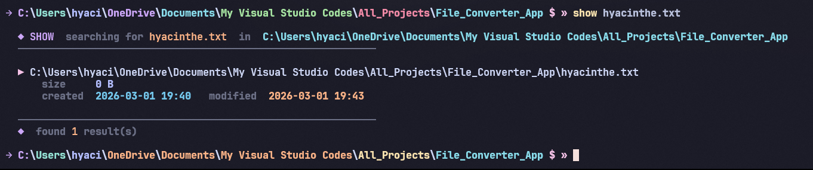

# PowerShell Catppuccin Mocha Profile

A minimal, beautiful PowerShell profile themed with [Catppuccin Mocha](https://github.com/catppuccin/catppuccin). Inspired by Linux terminal aesthetics — built for Windows.


---

## Based on

This project is based on the work of [SleepyCatHey](https://github.com/SleepyCatHey). The original concept and setup were presented in his video — highly recommended if you want to understand the full setup or go further with your Windows terminal customization:

▶️ [Watch the original video](https://www.youtube.com/watch?v=z3NpVq-y6jU&t=16s)

---

## Features

- 🎨 **Catppuccin Mocha** colors throughout — prompt, welcome message, search output
- 🗂️ **Colored path segments** — each folder segment gets its own Mocha color
- 🕐 **Welcome message** — date, time, and a random dev quote on every startup
- ⚡ **Fastfetch** integration with random ASCII art support
- 🛠️ **Custom commands** — `ll`, `touch`, `which`, `show`
- 🔍 **`show` command** — file search with size, creation date, and modification date

---

## Preview







---

## Files in this repo

| File | For |
|------|-----|
| `Microsoft_PowerShell_profile.ps1` | PowerShell 7 profile |
| `fastfetch-random.ps1` | Fastfetch random ASCII script — PowerShell 7 |
| `Microsoft_PowerShell_profile-ps5.ps1` | Windows PowerShell 5 profile |
| `fastfetch-random-ps5.ps1` | Fastfetch random ASCII script — Windows PowerShell 5 |
| `config.jsonc` | Fastfetch config |
| `ascii-files/` | ASCII art `.txt` files for fastfetch |
| `settings.json` | Windows Terminal settings |

---

## Requirements

| Tool | Purpose |
|------|---------|
| [PowerShell 7](https://github.com/PowerShell/PowerShell) or Windows PowerShell | Required |
| [Windows Terminal](https://github.com/microsoft/terminal) | Recommended |
| [Nerd Font](https://www.nerdfonts.com/) | Required for icons |
| [fastfetch](https://github.com/fastfetch-cli/fastfetch) | Required for system info on startup |

---

## Installation

### 1. Install JetBrainsMono Nerd Font

```powershell
winget install -e --id DEVCOM.JetBrainsMonoNerdFont
```

After installing, open Windows Terminal → Settings → open the JSON file → replace its entire content with the `settings.json` included in this repo, then save.

---

### 2. Set up your PowerShell profile

Find your profile path:
```powershell
$PROFILE
```

It will return something like:
```
C:\Users\username\Documents\PowerShell\Microsoft.PowerShell_profile.ps1
```
or for Windows PowerShell:
```
C:\Users\username\Documents\WindowsPowerShell\Microsoft.PowerShell_profile.ps1
```

If the file doesn't exist yet, create it:
```powershell
New-Item -Path $profile.CurrentUserAllHosts -Type File -Force
```

Then close the terminal, navigate to that location, and replace the file's content with the correct file from this repo:

- **PowerShell 7** → use `Microsoft_PowerShell_profile.ps1`
- **Windows PowerShell 5** → use `Microsoft_PowerShell_profile-ps5.ps1`, but **rename it** to match your profile filename (`Microsoft_PowerShell_profile.ps1` or `profile.ps1`) before placing it

> **Windows PowerShell 5 only:** Save the profile file as **UTF-8 with BOM** in VS Code (click the encoding in the bottom right → "Save with Encoding" → "UTF-8 with BOM"), otherwise special characters and icons won't display correctly.

---

### ⚠️ If you get a script execution error

After setting everything up, you may see this error when opening PowerShell:

```
File C:\Users\username\Documents\PowerShell\Microsoft.PowerShell_profile.ps1 cannot be loaded
because running scripts is disabled on this system.
```
or
```
File C:\Users\username\Documents\WindowsPowerShell\profile.ps1 cannot be loaded
because running scripts is disabled on this system.
```

This is a Windows security restriction. Fix it by running the following command:

```powershell
Set-ExecutionPolicy -Scope CurrentUser RemoteSigned
```

Then close and reopen PowerShell — your profile should load correctly.

---

### 3. Install fastfetch

Choose one of the following:

```powershell
winget install fastfetch   # recommended
scoop install fastfetch
choco install fastfetch
```

Or download it directly from the [fastfetch releases page](https://github.com/fastfetch-cli/fastfetch/releases).

---

### 4. Set up fastfetch

Download the following files from this repo and move them to:
```
C:\Users\username\.config\fastfetch\
```

Files needed:
- `config.jsonc`
- The correct fastfetch script for your PowerShell version:
  - **PowerShell 7** → `fastfetch-random.ps1` (keep the name as is)
  - **Windows PowerShell 5** → `fastfetch-random-ps5.ps1`, **rename it** to `fastfetch-random.ps1` before placing it
- All ASCII art `.txt` files (from the `ascii-files/` folder)

> You will need to **create** the `.config` and `fastfetch` folders manually.  
> Set the `.config` folder attribute to **Hidden** if you want it to stay clean.

> If you don't want random ASCII art on startup, either keep only one `.txt` file or edit `fastfetch-random.ps1` to point to a single config.

---

## Commands

### `ll` — Detailed listing
Lists all files including hidden ones.
```powershell
ll
ll C:\some\path
```

### `touch` — Create or update a file
Creates an empty file, or updates its timestamp if it already exists — just like on Linux.
```powershell
touch notes.txt
touch script.ps1
```

### `which` — Find an executable
Returns the full path of an installed program.
```powershell
which python
which fastfetch
which code
```

### `show` — File search
Searches for files and displays size, creation date, and last modification date.

```powershell
show filename.txt           # current folder only
show filename               # current folder, all "filename.*"
show -u filename.txt        # user folder (C:\Users\you)
show -deep filename.txt     # entire C:\ drive
show -from "C:\path" name   # from a specific folder
```

**Example output:**
```
  ◆ SHOW  searching for  main.py  in  C:\Users\you\project
  ────────────────────────────────────────────────────────────

  ▶ C:\Users\you\project\main.py
      size     12.4 KB
      created  2024-11-01 10:22   modified  2025-02-28 14:05

  ────────────────────────────────────────────────────────────
  ◆  found  1  result(s)
```

---

## Customization

### Username highlight
Your username folder is automatically highlighted in **Lavender** using `$env:USERNAME` — no hardcoding needed.

### Colors
All colors are defined as ANSI RGB variables. Replace any RGB value with your own:
```powershell
$mauve = "`e[38;2;203;166;247m"  # replace 203;166;247 with your RGB values
```

### Quotes
Edit the `$quotes` array in the welcome message section to add your own.

### Prompt icon
The `»` icon requires a Nerd Font. You can swap it for any other Nerd Font glyph from [nerdfonts.com/cheat-sheet](https://www.nerdfonts.com/cheat-sheet).

---

## Catppuccin Mocha Palette

| Name | Hex | Usage |
|------|-----|-------|
| Mauve | `#CBA6F7` | Prompt icon, drive letter |
| Teal | `#94E2D5` | `Users` folder |
| Lavender | `#B4BEFE` | Username folder |
| Pink | `#F5C2E7` | Prompt symbol, quote icon |
| Peach | `#FAB387` | Quote text, prompt `$` |
| Green | `#A6E3A1` | Date, KB-sized files |
| Yellow | `#F9E2AF` | Date text, MB-sized files |
| Sky | `#89DCEB` | Search path |
| Sapphire | `#74C7EC` | Created date |
| Red | `#F38BA8` | Not found message |
| Overlay | `#6C7086` | Subtle labels |

---

## Credits

Big thanks to [SleepyCatHey](https://github.com/SleepyCatHey) whose project and video were the foundation of this setup. Go check out his work!

---

## License

MIT — do whatever you want with it.
