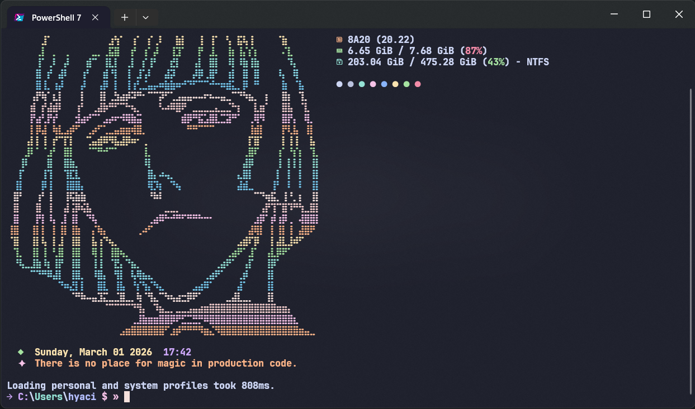
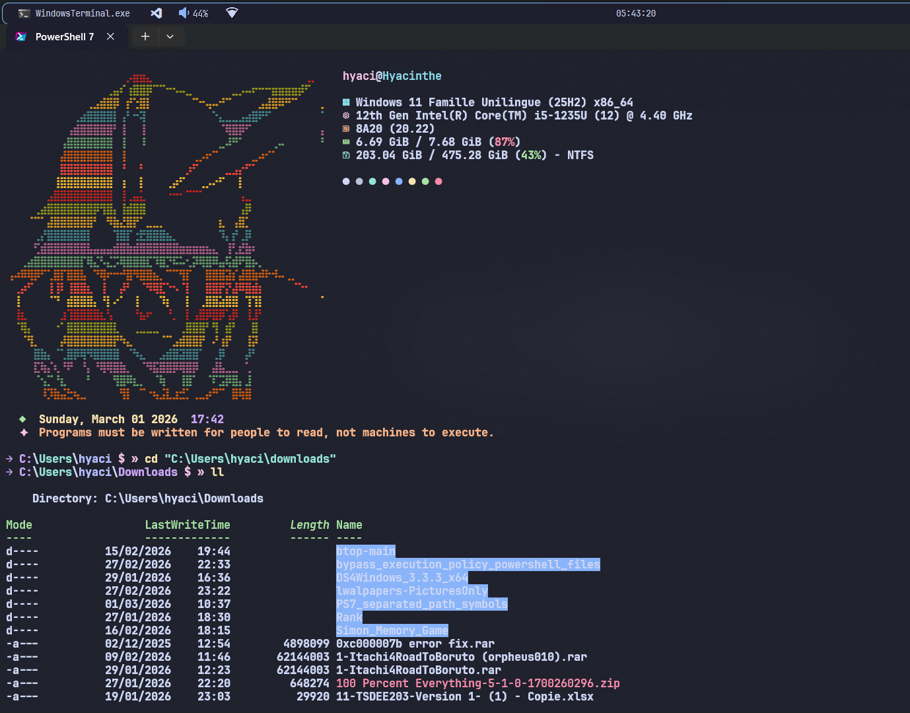
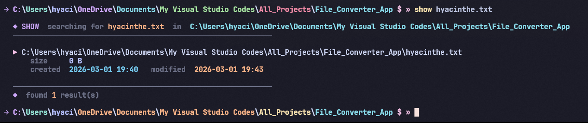
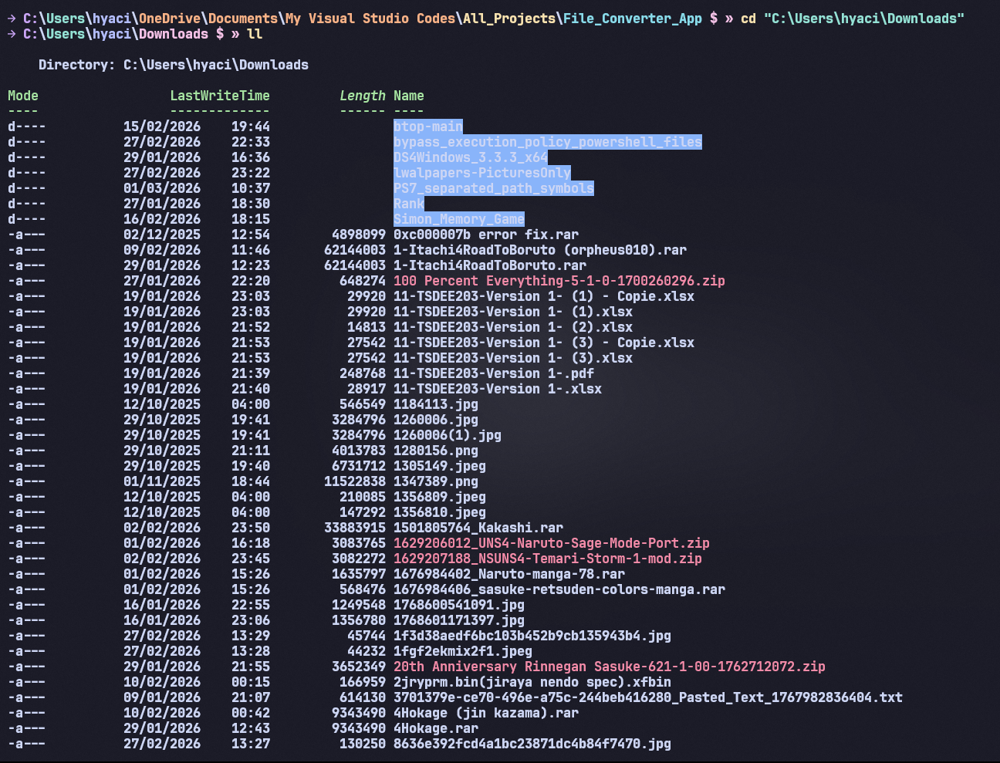
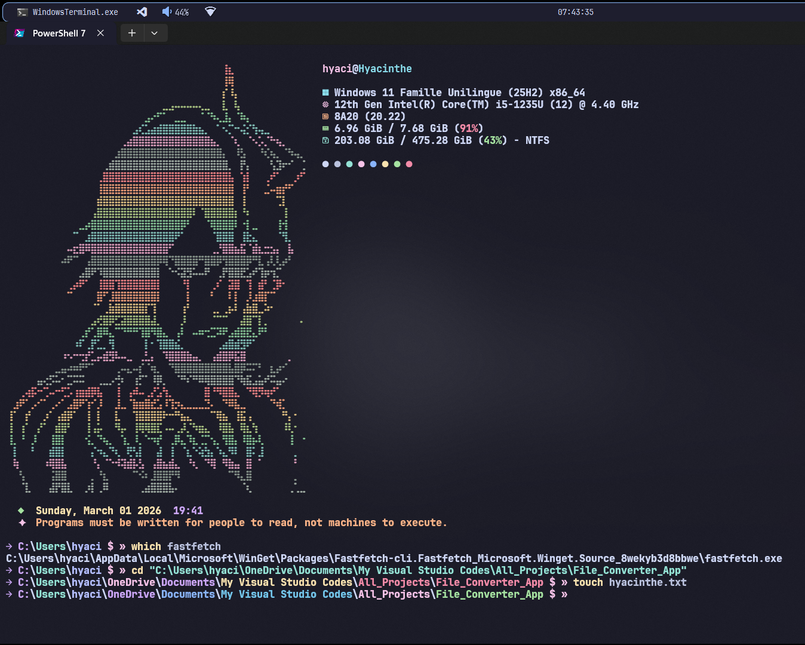

<div align="center">

# The Ultimate Way to Custom Your PowerShell

**A beautiful, Linux-inspired PowerShell setup for Windows – themed with [Catppuccin Mocha](https://github.com/catppuccin/catppuccin), powered by [fastfetch](https://github.com/fastfetch-cli/fastfetch), and finished with random anime ASCII art on every launch.**

[](https://github.com/PowerShell/PowerShell)
[](https://github.com/microsoft/terminal)
[](https://github.com/catppuccin/catppuccin)
[](https://windows.com)
[](LICENSE)

[Preview](#-preview) · [Install](#-installation) · [Commands](#-built-in-commands) · [Customize](#-customization) · [Troubleshoot](#-troubleshooting)

</div>

---

## ✨ What you get

Open a terminal and land in a workspace that feels alive:

- **Catppuccin Mocha everywhere** — welcome banner, prompt, command output, terminal scheme
- **Rainbow prompt** — every path segment gets its own Mocha color; your username is highlighted automatically
- **Welcome message** — date, time, and a random dev quote at every startup
- **Random ASCII art** — fastfetch picks a random anime character *and* a random color palette (8 themes: Catppuccin, Dracula, Nord, Tokyo Night, Gruvbox, Everforest, Rosé Pine…) each launch
- 🛠️ **12 built-in commands** — file search, directory bookmarks, weather, hashing, hex dumps and more (see [command reference](#-built-in-commands))
- **Zero dependencies beyond fastfetch** — pure PowerShell, no modules to install

---

## Preview



<details>
<summary><b>More screenshots</b></summary>

<br/>






</details>

---

## 🧠 How it works

```
Windows Terminal (settings.json — Catppuccin Mocha scheme + Nerd Font)
        │
        ▼
PowerShell profile (welcome message, custom commands, colored prompt)
        │
        ▼
fastfetch-random.ps1
        ├── picks a random ASCII art .txt from ~/.config/fastfetch/
        ├── picks a random color palette from 8 built-in themes
        └── injects both into config.jsonc → runs fastfetch
```

Everything happens locally at shell startup. No background processes, no telemetry.

---

## Repo contents

| File | Purpose |
|------|---------|
| `Microsoft_PowerShell_profile.ps1` | PowerShell **7** profile |
| `Microsoft_PowerShell_profile-ps5.ps1` | Windows PowerShell **5.1** profile |
| `fastfetch-random.ps1` | Random ASCII/palette launcher — PowerShell 7 |
| `fastfetch-random-ps5.ps1` | Same, compatible with PowerShell 5.1 |
| `config.jsonc` | Fastfetch configuration (modules + logo) |
| `ascii-files/` | ~25 ASCII art `.txt` files (Itachi, Gojo, Aizen, Sukuna…) |
| `settings.json` | Ready-to-use Windows Terminal settings |

---

## Requirements

| Tool | Required? | Notes |
|------|-----------|-------|
| [PowerShell 7](https://github.com/PowerShell/PowerShell) or Windows PowerShell 5 | ✔ Required | Both profiles are provided |
| [Nerd Font](https://www.nerdfonts.com/) | ✔ Required | JetBrainsMono Nerd Font recommended |
| [fastfetch](https://github.com/fastfetch-cli/fastfetch) | ✔ Required | System info panel |
| [Windows Terminal](https://github.com/microsoft/terminal) | Recommended | Use the included `settings.json` |

---

## Installation

### Step 1 – Install a Nerd Font

```powershell
winget install -e --id DEVCOM.JetBrainsMonoNerdFont
```

### Step 2 – Apply the Windows Terminal settings

Open **Windows Terminal → Settings → Open JSON file** (bottom-left), replace the entire content with the [`settings.json`](settings.json) from this repo, and save.

> This gives you the Catppuccin Mocha color scheme, acrylic transparency, and the correct font out of the box.

### Step 3 – Install your PowerShell profile

Find where your profile lives:

```powershell
$PROFILE
```

Typical locations:

```text
PowerShell 7           → C:\Users\<you>\Documents\PowerShell\Microsoft.PowerShell_profile.ps1
Windows PowerShell 5   → C:\Users\<you>\Documents\WindowsPowerShell\Microsoft.PowerShell_profile.ps1
```

Create it if it doesn't exist:

```powershell
New-Item -Path $PROFILE -Type File -Force
```

Then copy the matching file from this repo into that location:

| Your shell | File to copy | Rename? |
|------------|--------------|---------|
| PowerShell 7 | `Microsoft_PowerShell_profile.ps1` | No |
| Windows PowerShell 5 | `Microsoft_PowerShell_profile-ps5.ps1` | **Yes** → `Microsoft.PowerShell_profile.ps1` |

> [!IMPORTANT]
> **PowerShell 5 users:** open the profile in VS Code and re-save it as **UTF-8 with BOM** (bottom-right encoding selector → *Save with Encoding*), otherwise icons and special characters will break.

### Step 4 – Install fastfetch

```powershell
winget install fastfetch      # recommended
scoop install fastfetch
choco install fastfetch
```

Or grab it from the [releases page](https://github.com/fastfetch-cli/fastfetch/releases).

### Step 5 – Set up the fastfetch config

Copy these files from this repo into `C:\Users\<you>\.config\fastfetch\`:

1. `config.jsonc`
2. The fastfetch script for your shell:
   - **PowerShell 7** → `fastfetch-random.ps1` (keep the name)
   - **PowerShell 5** → `fastfetch-random-ps5.ps1`, **renamed to** `fastfetch-random.ps1`
3. Every `.txt` file from the [`ascii-files/`](ascii-files/) folder

The `.config\fastfetch` folders don't exist by default — create them manually.

> 💡 Want a single fixed logo instead of random ones? Keep only one `.txt` file in the folder, or point `config.jsonc` directly at it.

### Step 6 – Verify

Restart your terminal. You should see the ASCII art, welcome message, and colored prompt.
Type `help` to list every custom command.

---

## Built-in commands

Run `help` anytime inside the shell, or filter with `help <keyword>`.

### Quick reference

| Command | Category | Description |
|---------|----------|-------------|
| `ll` | Nav & Files | Detailed listing, including hidden files |
| `touch` | Nav & Files | Create an empty file / update timestamp |
| `mkcd` | Nav & Files | Create a directory and cd into it |
| `show` | Nav & Files | File search with size & dates |
| `cdh` | Nav & Files | Directory bookmarks (save / jump / delete) |
| `hex` | Nav & Files | Hex dump of any file |
| `cls` | Nav & Files | Clear the terminal |
| `whereis` | Tools | Locate commands *and* installed apps (registry) |
| `hash` | Tools | SHA256 / MD5 / SHA1, auto-copied to clipboard |
| `weather` | Tools | Live weather + 3-day forecast ([Open-Meteo](https://open-meteo.com)) |
| `help` | Tools | This reference, filterable by keyword |

### Highlights

**`show` – search files anywhere**

```powershell
show main.py             # current folder (substring match)
show .ps1                # all .ps1 files in current folder
show -u report.pdf       # search your entire user folder
show -deep bigfile.iso   # search the whole C:\ drive
show -from "D:\Projects" src   # search from a specific folder
```

Each result shows size, creation date, and last modification date.

**`whereis` – find anything**

```powershell
whereis git                    # resolves commands in PATH
whereis "Visual Studio Code"   # finds installed apps via the registry
```

Searches HKLM + HKCU uninstall keys (32 & 64-bit) and lists discovered `.exe` files.

**`cdh` – bookmark your directories**

```powershell
cdh                  # list bookmarks
cdh save             # bookmark current folder
cdh save myproject   # bookmark with a custom label
cdh myproject        # jump back later
cdh del myproject    # remove a bookmark
```

Bookmarks persist in `~/.config/hyacinthe/bookmarks.json`.

**`weather` – forecast without leaving the terminal**

```powershell
weather          # default city
weather Tokyo    # any city worldwide
```

Current conditions (temp, feels-like, humidity, wind, visibility) plus a 3-day forecast.

**`hash` / `hex` – inspect files**

```powershell
hash app.exe            # SHA256 (default), copied to clipboard
hash app.exe -md5       # MD5 instead
hash -text "hello"      # hash a raw string

hex payload.bin         # first 256 bytes as hex + ASCII
hex payload.bin 512     # first N bytes
```

---

## Customization

| What | Where | How |
|------|-------|-----|
| Colors | Profile (`$mauve`, `$peach`, …) | Swap any ANSI RGB value: `` "`e[38;2;203;166;247m" `` |
| Quotes | `$quotes` array in the profile | Add/remove your own dev quotes |
| Default weather city | `weather` function's `$city` param | Change `"Sydney"` to your city |
| Prompt icon | `prompt` function | Replace `»` with any glyph from the [Nerd Font cheat sheet](https://www.nerdfonts.com/cheat-sheet) |
| ASCII art | `~/.config/fastfetch/*.txt` | Drop in your own art — one random file is picked per launch |
| Color palettes | `$palettes` array in `fastfetch-random.ps1` | Add your own theme (Dracula, Gruvbox… already included) |
| Transparency / font | `settings.json` | `opacity`, `font.face`, `font.size` |

Your username segment is highlighted automatically via `$env:USERNAME` — nothing to hardcode.

---

## Troubleshooting

<details>
<summary><b>"running scripts is disabled on this system"</b></summary>

This is Windows' execution policy. Run once:

```powershell
Set-ExecutionPolicy -Scope CurrentUser RemoteSigned
Unblock-File "$env:USERPROFILE\.config\fastfetch\fastfetch-random.ps1"
Unblock-File "$env:USERPROFILE\Documents\PowerShell\Microsoft.PowerShell_profile.ps1"
Unblock-File "$env:USERPROFILE\Documents\WindowsPowerShell\profile.ps1"
```

Then reopen the terminal.
</details>

<details>
<summary><b>Icons render as boxes / question marks (PowerShell 5)</b></summary>

Re-save the profile as **UTF-8 with BOM**: open it in VS Code → click the encoding indicator (bottom-right) → *Save with Encoding* → *UTF-8 with BOM*.
</details>

<details>
<summary><b>Prompt icons look broken even with a Nerd Font installed</b></summary>

Make sure Windows Terminal actually uses it — check `"face": "JetBrainsMono Nerd Font Mono"` under `profiles.defaults.font` in your Terminal settings JSON.
</details>

<details>
<summary><b>No system info on startup</b></summary>

Fastfetch may not be on your `PATH`. Test with `fastfetch --version`; if it fails, reinstall via `winget install fastfetch` and reopen the terminal.
</details>

---

## Credits

This project builds on the work of [SleepyCatHey](https://github.com/SleepyCatHey) — the original concept and setup were presented in [his video](https://www.youtube.com/watch?v=z3NpVq-y6jU). Highly recommended if you want to understand the full stack or push your Windows terminal even further.

Palette by [Catppuccin](https://github.com/catppuccin/catppuccin) · System info by [fastfetch](https://github.com/fastfetch-cli/fastfetch)

---

## Support

If this setup made your terminal nicer, consider leaving a star or [sponsoring the project](https://github.com/sponsors/Hyacinthe-primus).

---

## License

[MIT](LICENSE) – do whatever you want with it.
