# PowerShell 7 — Modular Profile

A modular, animated PowerShell 7 profile themed with [Catppuccin Mocha](https://github.com/catppuccin/catppuccin).  
Built as a natural evolution of the root profile — same aesthetic, deeper features.

[](https://github.com/PowerShell/PowerShell)
[](https://github.com/microsoft/terminal)
[](https://github.com/catppuccin/catppuccin)
[](https://www.microsoft.com/windows)

---

## What's different from the root profile?

The root profile is a single-file setup — simple and easy to drop in.  
This one splits everything into modules, each in its own `.ps1` file under a `profile/` folder.  
Same Catppuccin Mocha theme, but with more commands, animations, and a personalised welcome sequence and others

---

## Preview

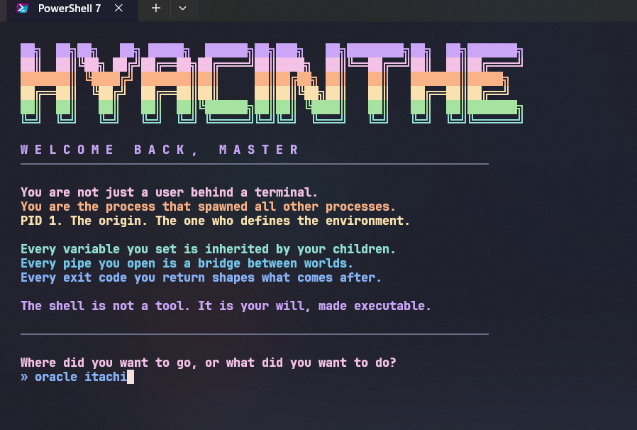
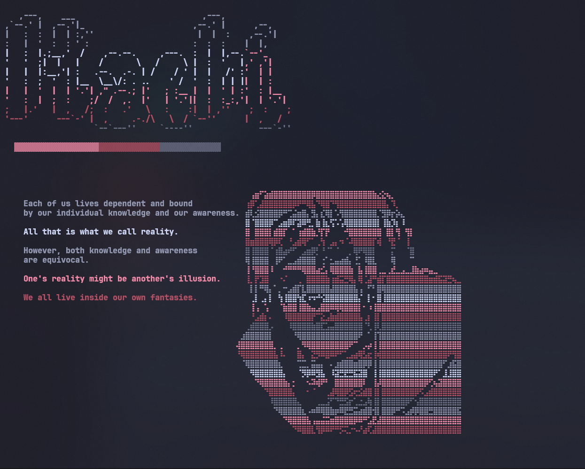
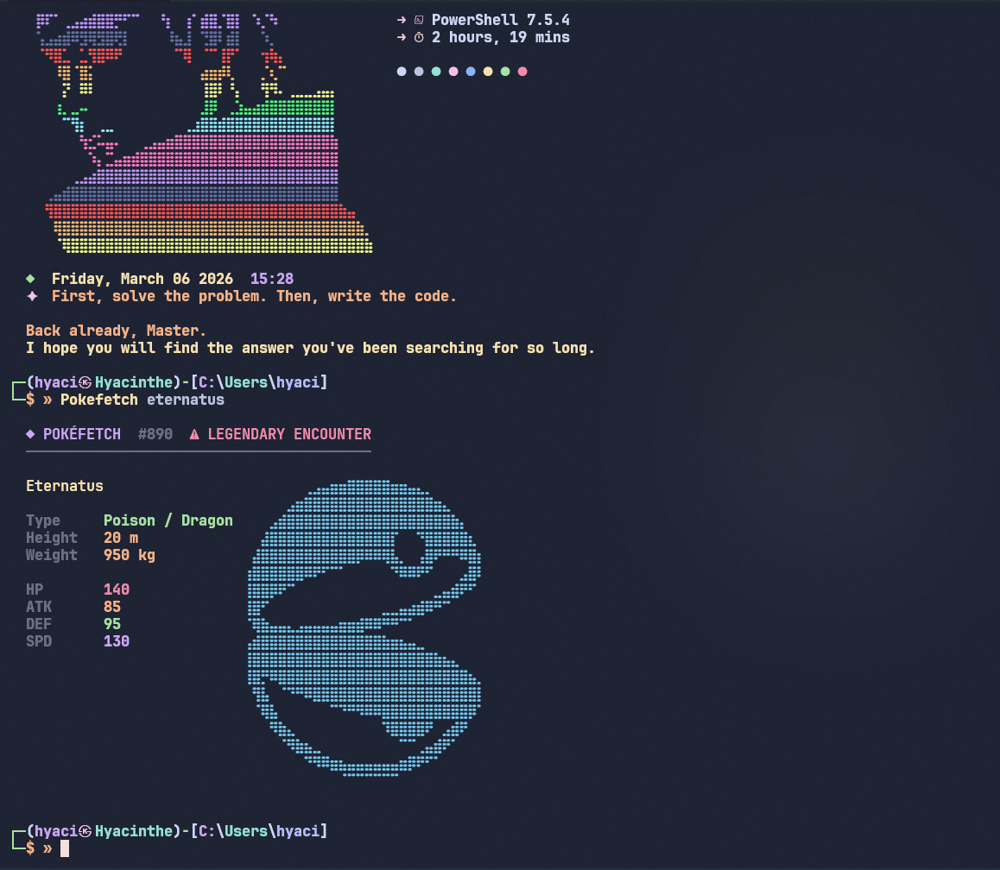
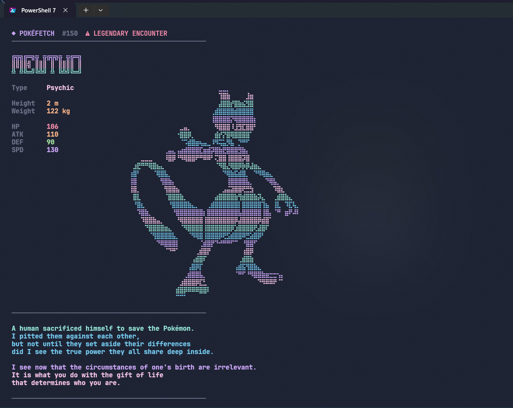
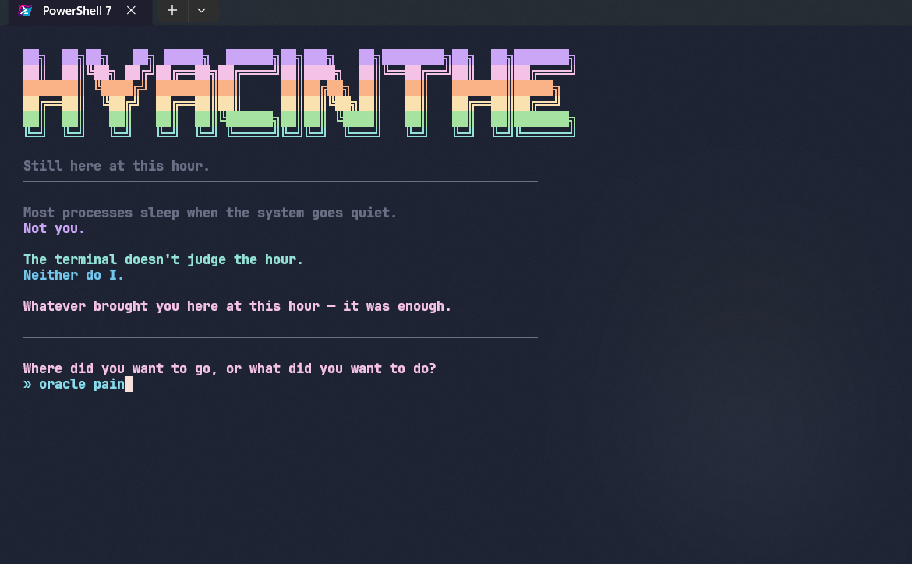
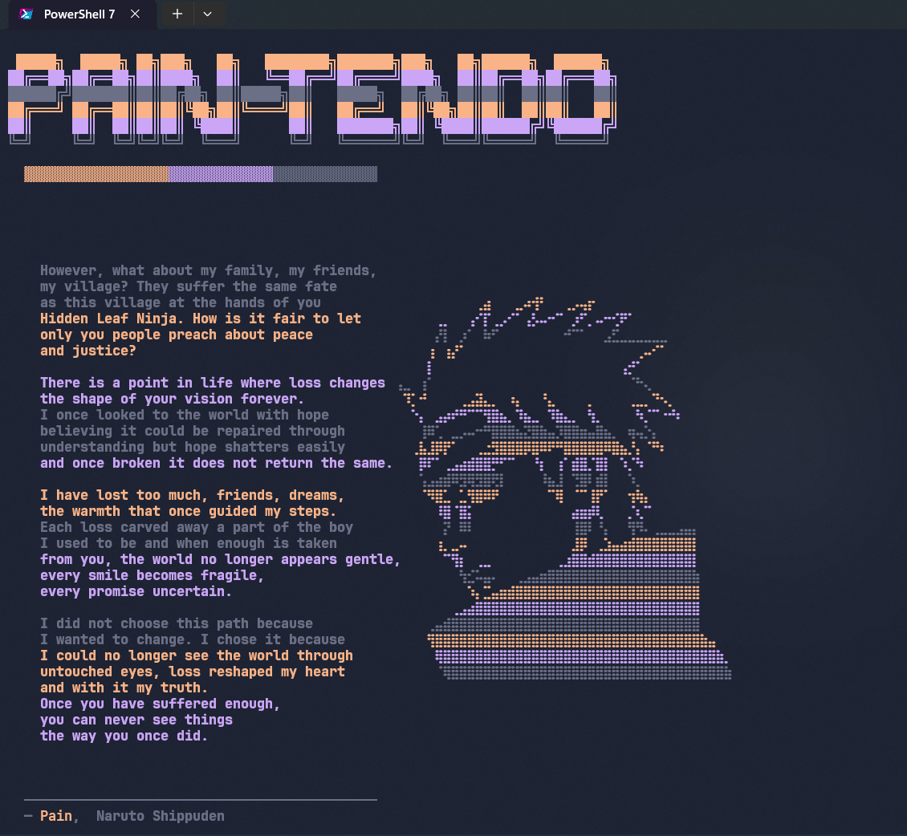
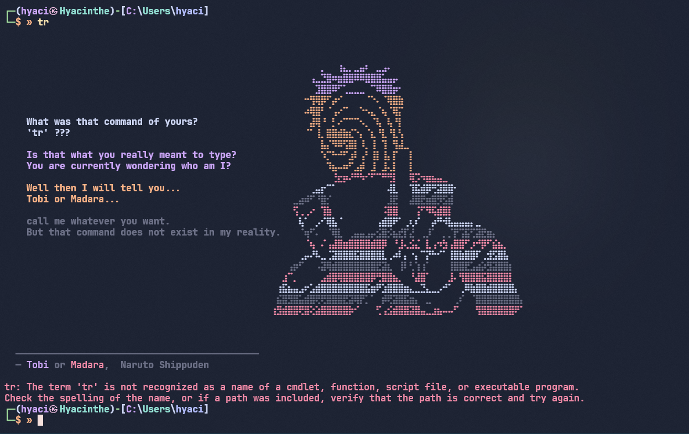
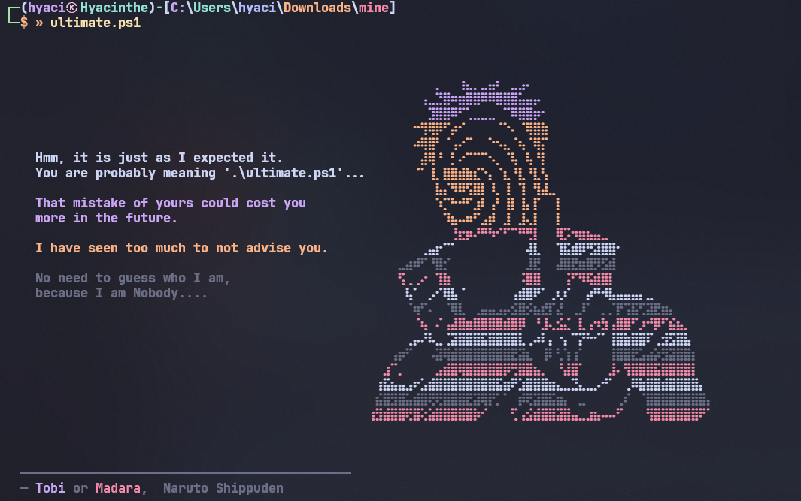
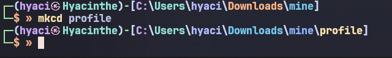
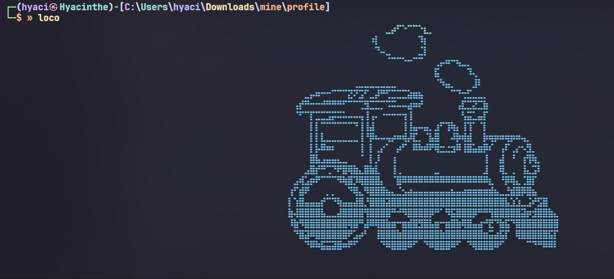
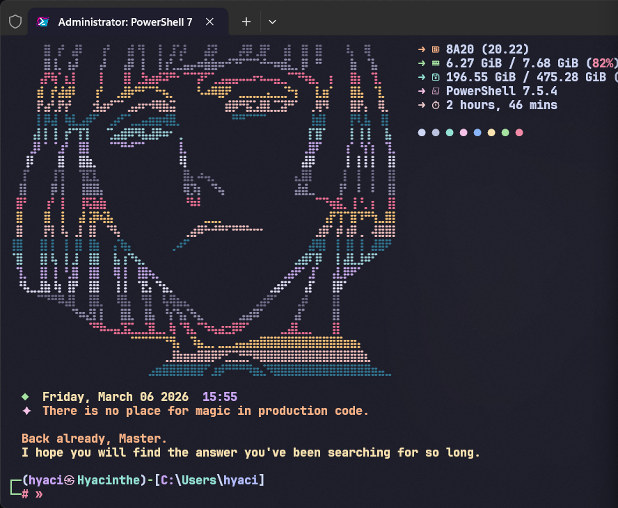

## Demo

[](demo.mp4)

---

## File structure

```
powershell7/
├── Microsoft_PowerShell_profile.ps1   ← main entry point, loads all modules
├── EXECUTION_POLICY.md                ← how to unblock scripts on Windows
└── profile/
    ├── colors.ps1       ← Catppuccin Mocha palette variables
    ├── helpers.ps1      ← Type-Slow, Type-Fast, Pulse-Line
    ├── session.ps1      ← session counter + date/time display
    ├── aliases.ps1      ← ll, touch, which, mkcd, hs, show, uptime
    ├── prompt.ps1       ← two-line prompt with Git branch + Mocha colors
    ├── welcome.ps1      ← personalised welcome sequence (USERNAME command)
    ├── pokefetch.ps1    ← Pokémon stats fetcher
    ├── animations.ps1   ← train, hack, matrix animations
    └── errors.ps1       ← CommandNotFound handler (Tobi / Madara)
```

---

## Requirements

| Tool | Purpose |
|---|---|
| [PowerShell 7](https://github.com/PowerShell/PowerShell) | Required |
| [Windows Terminal](https://github.com/microsoft/terminal) | Recommended |
| [Nerd Font](https://www.nerdfonts.com/) | Required for icons |
| [fastfetch](https://github.com/fastfetch-cli/fastfetch) | Optional — system info on startup |

---

## Installation

### 1. Find your PowerShell 7 profile path

```powershell
$PROFILE
```

It will return something like:

```
C:\Users\username\Documents\PowerShell\Microsoft.PowerShell_profile.ps1
```

If the file doesn't exist yet, create it:

```powershell
New-Item -Path $PROFILE -Type File -Force
```

---

### 2. Place the files
Note: You can have profile.ps1 or Microsoft_PowerShell_profile.ps1 in that location

Copy `Microsoft_PowerShell_profile.ps1` to the location returned by `$PROFILE`.  
Then create a `profile\` subfolder **next to it** and copy all the `.ps1` files from [`profile/`](./profile/) into it:

```
Documents\PowerShell\
├── Microsoft.PowerShell_profile.ps1
└── profile\
    ├── colors.ps1
    ├── helpers.ps1
    ├── session.ps1
    ├── aliases.ps1
    ├── prompt.ps1
    ├── welcome.ps1
    ├── pokefetch.ps1
    ├── animations.ps1
    └── errors.ps1
```

---

### 3. Unblock the scripts

Windows flags downloaded `.ps1` files as potentially unsafe. Run this once after placing the files:

```powershell
Set-ExecutionPolicy -ExecutionPolicy RemoteSigned -Scope CurrentUser
Unblock-File "$env:USERPROFILE\Documents\PowerShell\Microsoft.PowerShell_profile.ps1"
Unblock-File "$env:USERPROFILE\.config\fastfetch\fastfetch-random.ps1"
Get-ChildItem "$env:USERPROFILE\Documents\PowerShell\profile\*.ps1" | Unblock-File
```

> Repeat the `Unblock-File` step after every `git pull` or file update.  
> Full details in [`EXECUTION_POLICY.md`](./EXECUTION_POLICY.md).

---

### 4. Personalise the welcome sequence

Open `profile\welcome.ps1` and replace every occurrence of `Username` with your actual name.  
Casing must match exactly — wrong casing intentionally triggers the intruder alert sequence.
Here is the link to do your own ASCII art of your username: [Custom Username](https://patorjk.com/software/taag/#p=display&f=ANSI+Shadow&t=USERNAME&x=none&v=4&h=4&w=80&we=false)

```powershell
# Before
function Username { ... }

# After (example)
function Alice { ... }
```

---

## Features

### Prompt — two-line Git-aware prompt

Each path segment gets a different Catppuccin Mocha color, rotating through the full palette.  
The second line shows the current Git branch when inside a repo.

```
╭─ 󰉖  C  ❯  Users  ❯  alice  ❯  projects  ❯  my-repo   main
╰─ »
```

---

### Welcome sequence — `Username`

Type your name (exact casing) to trigger a personalised animated welcome.  
Wrong casing shows an **INTRUSION DETECTED** alert sequence.  
Pass `-night` for the late-night variant.

```powershell
Alice           # standard welcome
Alice -night    # late-night mode
```

---

### Animations

#### `train` / `loco` — braille ASCII train rolling across the terminal

```powershell
train
loco
```
This is an alternative to `sl` command which is present Linux

#### `hack` — fake hacking sequence with progress bars, scan lines, and burst text

```powershell
hack
```

This is just for flexing


#### `matrix` — falling characters, full terminal, configurable duration

```powershell
matrix              # default (15s)
matrix -s 30        # 30 seconds
matrix -infinite    # until Ctrl+C
matrix -half        # left half of terminal only
```

---

### `pokefetch` — Pokémon stats fetcher

Fetches live data from the PokéAPI. Pass a name or Pokédex ID.

```powershell
pokefetch           # random Pokémon
pokefetch pikachu
pokefetch 6
```

---

### Aliases & utility commands

#### `ll` — detailed listing including hidden files

```powershell
ll
ll C:\some\path
```

#### `touch` — create a file or update its timestamp

```powershell
touch notes.txt
```

#### `which` — find an executable's path

```powershell
which python
which code
```

#### `mkcd` — create a folder and cd into it

```powershell
mkcd my-new-project
```

#### `hs` — history search

```powershell
hs              # full history
hs git          # filter by keyword
```

#### `show` — file search with size and dates

```powershell
show filename.txt           # current folder
show filename               # all extensions
show -u filename.txt        # user folder
show -deep filename.txt     # entire C:\ drive
show -from "C:\path" name   # from a specific folder
```

#### `uptime` — animated system uptime display

```powershell
uptime
```

---

### Session counter

On startup, the profile displays the current date, time, and a random dev quote.  
It also tracks how many sessions you've opened today and in total, stored in `~\.config\ps-profile\session.json`.

---

### CommandNotFound handler

Mistyping a command triggers an animated **Tobi / Madara** response instead of a plain error.

---

## Customization

### Colors

All colors are defined as ANSI RGB variables in `profile\colors.ps1`. Replace any value with your own:

```powershell
$mauve = "$ESC[38;2;203;166;247m"  # replace 203;166;247 with your RGB
```

### Quotes

Edit the `$quotes` array in `profile\session.ps1` to add your own startup quotes.

### Fastfetch

If fastfetch is installed and a `fastfetch-random.ps1` exists at `~\.config\fastfetch\`, it runs automatically on startup. Remove or comment out that block in the main profile if you don't use it.

If you want a fastfetch configuration, chek the root files

---

## Catppuccin Mocha Palette

| Name | Hex | Usage |
|---|---|---|
| Mauve | `#CBA6F7` | Prompt icon, drive letter, section headers |
| Teal | `#94E2D5` | `Users` folder, Pokémon types |
| Lavender | `#B4BEFE` | Username folder |
| Pink | `#F5C2E7` | Prompt symbol, file arrows |
| Peach | `#FAB387` | Quote text, search results |
| Green | `#A6E3A1` | Date, KB-sized files, Matrix rain |
| Yellow | `#F9E2AF` | Date text, MB-sized files |
| Sky | `#89DCEB` | Search path |
| Sapphire | `#74C7EC` | Created date |
| Red | `#F38BA8` | Not found message, intrusion alert |
| Overlay | `#6C7086` | Subtle labels and separators |

---

## Credits

Built on top of [SleepyCatHey](https://github.com/SleepyCatHey)'s original concept.  

PokéAPI data via [pokeapi.co](https://pokeapi.co).

Custom ASCII art via [patorjk.com](https://patorjk.com/software/taag/#p=display&f=ANSI+Shadow&t=USERNAME&x=none&v=4&h=4&w=80&we=false)

NoCopyrightSounds from [Different Heaven - Safe And Sound](https://youtu.be/13ARO0HDZsQ?si=FshSIxUKBTstkHeC)

---

## License

MIT — do whatever you want with it.
